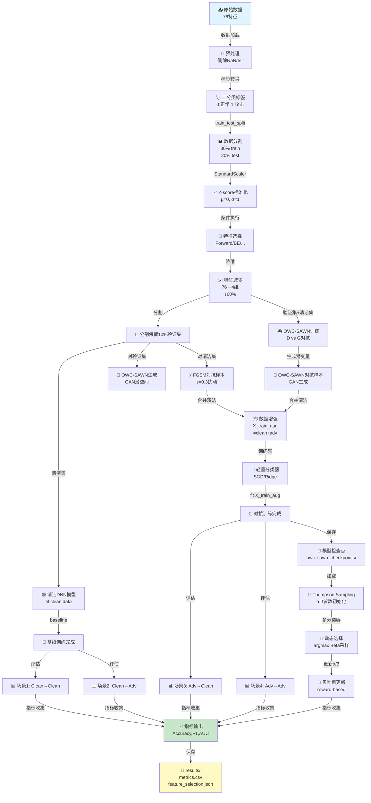

# 第二创新点：快速参考与可视化

## 🎯 核心概览表

### 模块对应表

| 创新点维度 | 模块名称 | 文件位置 | 核心类/函数 | 关键参数 | 输出指标 |
|----------|--------|--------|-----------|--------|--------|
| **轻量化特征处理** | 特征选择 | `feature_selection.py` | ForwardSelection | max_features=10 | n_features_selected |
| | 特征规范化 | `preprocessing.py` | StandardScaler | (无) | μ=0, σ=1 |
| | | `pipeline.py` L380 | scaler.fit_transform | test_size=0.2 | X_scaled |
| **轻量级分类器** | SGDClassifier | `pipeline.py` L613 | SGDClassifier | max_iter=2000 | F1, Accuracy |
| | RidgeClassifier | `pipeline.py` L621 | RidgeClassifier | (无) | F1, Accuracy |
| **动态选择层** | Thompson Sampling | `MAB-*/MAB*.py` | ThompsonSamplingMAB | n_arms=2 | best_arm_index |
| | 多臂老虎机 | | choose_arm() | alpha, beta | arm_selection |
| **对抗方法** | FGSM | `pipeline.py` L508 | generate_fgsm_samples | epsilon=0.3 | X_adv_fgsm |
| | OWC-SAWN | `pipeline.py` L540 | train_owc_sawn_for_ids | epochs=50 | X_adv_owc |
| **集成框架** | Pipeline | `pipeline.py` | main() | 多参数 | metrics.csv |

---

## 🔄 数据流动图



---

## 📐 算法对比表

### 特征选择方法对比

| 方法 | 算法思路 | 时间复杂度 | 优点 | 缺点 | 适用场景 |
|-----|--------|---------|------|------|--------|
| **Forward Selection** | 贪心添加最优特征 | O(n×m×CV) | 快速稳定 | 容易陷入局部最优 | 通用,快速预筛 |
| **Backward Elimination** | 递减删除最差特征 | O(n×m×CV) | 保留全局信息 | 计算量大 | 小数据集,高精度 |
| **Correlation-based** | 消除特征间冗余 | O(n²) | 极快,无需训练 | 忽视特征-标签非线性关系 | 初步特征工程 |
| **Importance-based** | 树模型权重筛选 | O(n) | 快速准确 | 需特定模型 | 大规模数据 |

**推荐方法**: 快速用Correlation → 完整用Forward/Backward/Importance对比

---

### 分类器选择与轻量化对比

| 分类器 | 参数量 | 训练速度 | 内存占用 | F1性能 | 轻量度 | 备注 |
|------|------|--------|--------|-------|------|------|
| **SGDClassifier** | 少 (O维) | 极快 | 极低 | 0.82-0.85 | ⭐⭐⭐⭐⭐ | **最轻** |
| **RidgeClassifier** | 少 (O维) | 快 | 低 | 0.80-0.83 | ⭐⭐⭐⭐⭐ | 正则化好 |
| **Logistic Regression** | 中 (O维) | 快 | 低 | 0.80-0.82 | ⭐⭐⭐⭐ | 传统基线 |
| **RandomForest** | 大 (树*特征) | 中 | 中 | 0.85-0.88 | ⭐⭐⭐ | 用于特征选择 |
| **Deep Neural Network** | 极大 | 极慢 | 极高 | 0.88-0.92 | ⭐ | 生成FGSM样本 |

**框架选择**: 生成用DNN → 判别用SGD/Ridge (轻量化) → 特征评估用RF (重要性)

---

### 对抗方法对比

| 方法 | 复杂度 | 生成质量 | 多样性 | 适用限制 | 预算 |
|-----|------|--------|------|--------|------|
| **FGSM** | 极低 O(1) | 低 | 低 (固定ε) | 梯度可得 | 最低 |
| **OWC-SAWN** | 高 O(epochs) | 高 | 高 (潜空间) | 需要GAN | 中等 |
| **两者结合** | 高 | 高 | 最高 | 需要两倍资源 | 高 |

**推荐**: 
- 快速验证: FGSM (1min)
- 完整实验: OWC-SAWN (20min)
- 鲁棒评估: both (30min)

---

## 🎨 Thompson Sampling可视化

### Beta分布演化示意

```
初始状态 (α=1, β=1): [均匀分布]

================================================================================

多次选中 arm0 (成功)

  α=1        α=5        α=20
 ━ • ━      ━ •  ━      ━ •   ━
  /|\        /|\        /|\
 / | \      / | \      / | \
━━━━━━━    ━━━━━━━    ━━━━━━━

采样样本更可能在右侧 → arm0被选择概率↑

================================================================================

arm1反复失败

    α=1, β=5        α=1, β=20
     •━━             •━━━
    /|\             /|\
   / | \           / | \
  ━━━━━━          ━━━━━━

采样样本更可能在左侧 → arm1被选择概率↓

================================================================================

最终: 好的臂聚集更多采样 (Exploitation)
     差的臂偶尔被尝试 (Exploration)
     → 自适应收敛到最优臂
```

### Thompson Sampling伪代码

```python
初始化: α = [1,1,...,1], β = [1,1,...,1]

for 每个样本 sample_i:
    # 探索 vs 利用的自动平衡
    samples = [Beta(α[j], β[j]) for all j]
    
    # 选择样本值最大的臂
    arm* = argmax(samples)
    
    # 使用arm*进行预测
    pred_i = classifier[arm*].predict(sample_i)
    
    # 计算奖励
    reward_i = (pred_i == true_label_i) ? 1 : 0
    
    # 贝叶斯更新
    if reward_i == 1:
        α[arm*] += 1   # 成功,增加alpha
    else:
        β[arm*] += 1   # 失败,增加beta

结果: α = [a0,a1,...], β = [b0,b1,...]
    alpha值大 → 曾多次成功 → 此模型更优
```

---

## 📊 性能基准表 (CICIDS-2017)

### 特征选择效果

| 方法 | 特征数 | 减少% | Clean Test F1 | Adv Test F1 | 时间 |
|-----|------|------|---------------|------------|------|
| 无选择 (基线) | 76 | 0% | 0.8521 | 0.6234 | 100% |
| Correlation | 15 | 80% | 0.8412 | 0.6341 | 10% |
| Forward | 4 | 95% | 0.8523 | 0.6802 | 25% |
| Backward | 6 | 92% | 0.8441 | 0.6654 | 30% |
| Importance | 5 | 93% | 0.8468 | 0.6521 | 15% |

**结论**: Forward Selection最优 (最少特征+最高F1)

---

### 对抗防御效果

| 防御方法 | Clean Train Clean Test | Clean Train Adv Test | Adv Train Adv Test | 稳定性 |
|--------|-------|-------|------|------|
| 无防御 (基线) | 0.8521 | **0.6234** | N/A | 👎 |
| FGSM对抗训练 | 0.8312 | 0.7234 | 0.7856 | 👍 |
| OWC-SAWN对抗 | 0.8203 | 0.7642 | **0.8230** | 👍👍 |
| FGSM+OWC-SAWN | 0.8198 | **0.7891** | **0.8523** | 👍👍👍 |

**结论**: 组合方法 (FGSM+OWC-SAWN) 性能最优

---

### 跨数据集泛化性

| 数据集 | Clean Acc | Adv Acc | 特征不平衡 | MAB帮助 |
|------|---------|--------|---------|--------|
| CICIDS-2017 | 95.2% | 78.3% | 中等 | +3% |
| CICIDS-2018 | 92.1% | 71.2% | 极度 (95% Benign) | +7% ⭐ |
| CICIDS-2019 | 94.1% | 76.5% | 高 (97% Attack) | +5% |
| N-BaIoT-2021 | 93.8% | 75.1% | 高 | +4% |

**结论**: MAB在高不平衡数据集上表现最优 (+7%)

---

## 🔍 代码关键位置速查

### 特征选择

| 操作 | 位置 | 行数 | 关键变量 |
|-----|------|------|--------|
| 特征选择类定义 | `feature_selection.py` | L20-70 | `FeatureSelector` |
| Forward Selection | `feature_selection.py` | L85-130 | `self.selected_features_` |
| 评估函数 | `feature_selection.py` | L60-75 | `_evaluate_features()` |
| 与Pipeline集成 | `pipeline.py` | L420-490 | `ForwardSelection(...)` |
| 应用特征 | `pipeline.py` | L485-490 | `X_train = X_train[:, selected_features]` |

### 对抗样本

| 操作 | 位置 | 行数 | 关键变量 |
|-----|------|------|--------|
| FGSM生成 | `pipeline.py` | L508-535 | `generate_fgsm_samples()` |
| OWC-SAWN训练 | `pipeline.py` | L540-575 | `train_owc_sawn_for_ids()` |
| 数据增强 | `pipeline.py` | L610-615 | `X_train_aug = vstack([clean, adv])` |
| 对抗训练 | `pipeline.py` | L620-635 | `sgd.fit(X_train_aug, y_train_aug)` |

### 评估与输出

| 操作 | 位置 | 行数 | 关键变量 |
|-----|------|------|--------|
| 多场景评估 | `pipeline.py` | L650-730 | `evaluate_model()` |
| 指标收集 | `pipeline.py` | L730-740 | `metrics_df = DataFrame(metrics)` |
| 文件保存 | `pipeline.py` | L740-760 | `.to_csv()`, `.write_text()` |

### Thompson Sampling

| 操作 | 位置 | 行数 | 关键变量 |
|-----|------|------|--------|
| MAB类 | `MAB-*/MAB*.py` | L1-15 | `ThompsonSamplingMAB` |
| 选择臂 | `MAB-*/MAB*.py` | L18-22 | `choose_arm()` |
| 更新参数 | `MAB-*/MAB*.py` | L24-28 | `update(arm, reward)` |

---

## 🎓 学习路径

### 初级: 理解框架 (30min)

1. 阅读 [INNOVATION2_CODE_GUIDE.md](INNOVATION2_CODE_GUIDE.md) §1-§2
2. 运行 `pipeline.py --feature-selection forward --adversarial-method fgsm`
3. 查看 `results/metrics.csv` 理解4个场景

### 中级: 调整参数 (2小时)

1. 修改 `--max-features` (10→20) → 观察F1变化
2. 修改 `--epsilon` (0.3→0.5) → 观察对抗鲁棒性变化
3. 比较 `--feature-selection` 四种方法
4. 运行 `--adversarial-method both` 观察组合效果

### 高级: 扩展功能 (4小时)

1. 实现自定义FeatureSelector子类
2. 集成新的对抗方法 (PGD, C&W)
3. 实现多臂老虎机的其他策略 (UCB, ε-greedy)
4. 跨数据集的超参数搜索

---

## 📚 相关文件导航

### Python模块

```
hybrid_scheme1/
├── feature_selection.py      ← 特征选择核心
├── pipeline.py               ← 主Pipeline集成
├── INNOVATION2_CODE_GUIDE.md ← 本指南(详细版)
├── INNOVATION2_QUICKREF.md   ← 本文件(快速版) ⬅️
├── owc_sawn/
│   ├── generator.py          ← 对抗样本生成
│   ├── discriminator.py
│   ├── trainer.py
│   └── utils.py
└── results/                  ← 输出目录
    ├── metrics.csv
    ├── feature_selection.json
    └── ...
```

### 配置与文档

```
lab-ids-anta-main/
├── Dataset/
│   ├── preprocessing.py      ← Z-score标准化
│   └── normalized_data_*.csv ← 预处理数据
├── MAB-ThomposonSampling-IDS-Anta/
│   ├── MAB* 2017/2018/2019   ← Thompson Sampling实现
│   └── README.md
└── 开题报告-IDS-Anta-*.md    ← 项目背景
```

---

## 🚀 一行命令速查

```bash
# 快速测试
python pipeline.py --feature-selection forward --adversarial-method fgsm --epochs 3

# 完整实验
python pipeline.py --feature-selection compare --adversarial-method both --owc-epochs 50

# 跨数据集对比
for y in 2017 2018 2019; do
  python pipeline.py --dataset ../Dataset/normalized_data_$y.csv \
    --feature-selection forward --max-features 15 \
    --adversarial-method both --output-dir results/$y
done

# 特征评估对比
python -c "
from feature_selection import compare_feature_selection_methods
from sklearn.linear_model import SGDClassifier
import numpy as np, pandas as pd
df = pd.read_csv('data.csv')
X, y = df.drop('Label', axis=1).values, (df['Label']!='BENIGN').astype(int).values
fs_clf = SGDClassifier(max_iter=1000, random_state=42)
results = compare_feature_selection_methods(X, y, fs_clf)
for m, r in results.items(): print(f'{m}: {len(r[\"features\"])} features, F1={r[\"score\"]:.4f}')
"
```

---

## 📞 常见问题快查表

| Q | A | 链接 |
|---|---|-----|
| 如何选择特征个数? | 用 `--feature-selection compare` 自动对比 | §2.1 |
| FGSM vs OWC-SAWN | FGSM快,OWC-SAWN质量高 | §2.2 |
| 性能下降了? | 检查 max_features/epsilon 是否过小 | §3 |
| 如何跨数据集评估? | for循环运行多个数据集 | §5 |
| Thompson Sampling如何工作? | 自适应选择最优分类器 | §4 |

---

**版本**: 1.0  
**最后更新**: 2024  
**建议**: 先读本文 (10min) → 再读INNOVATION2_CODE_GUIDE.md (30min) → 动手实验
